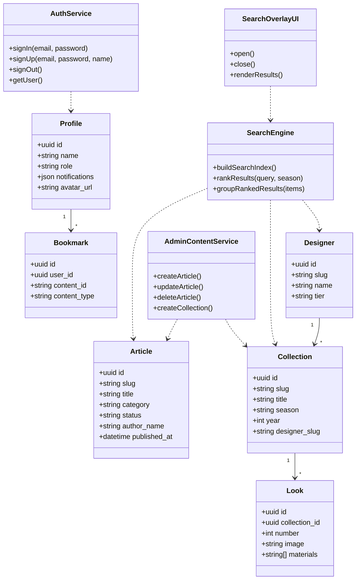
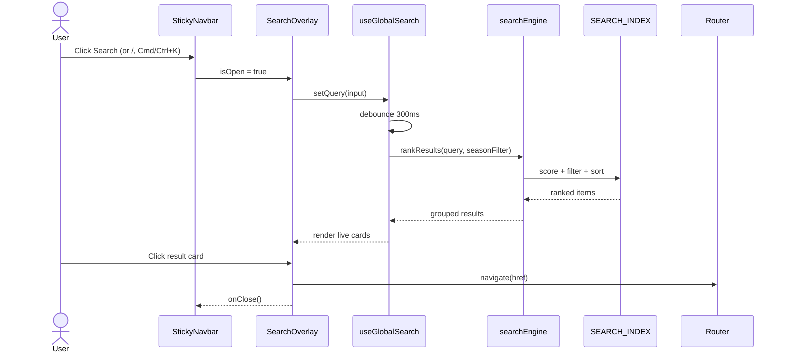
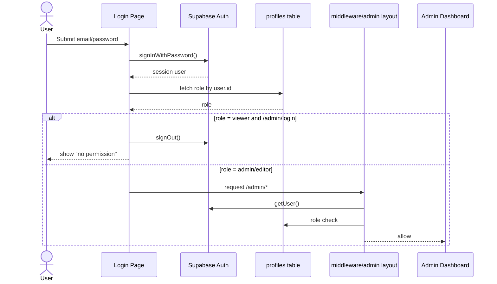
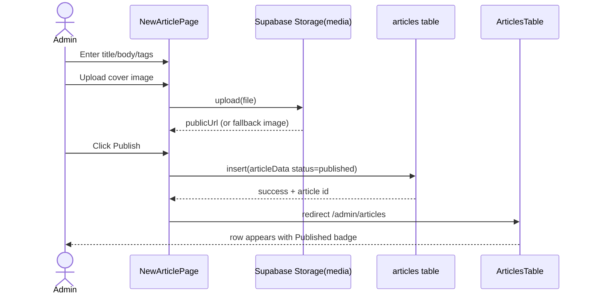
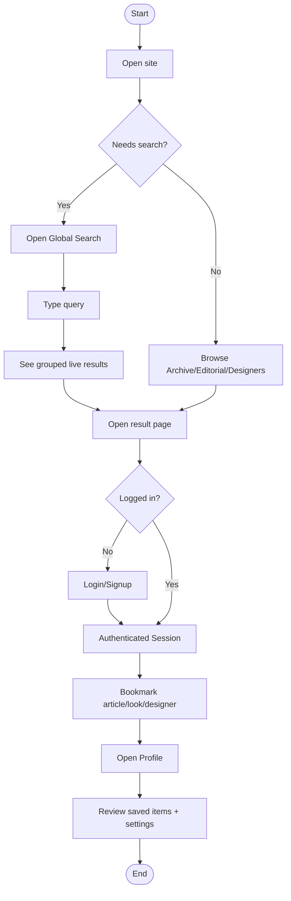
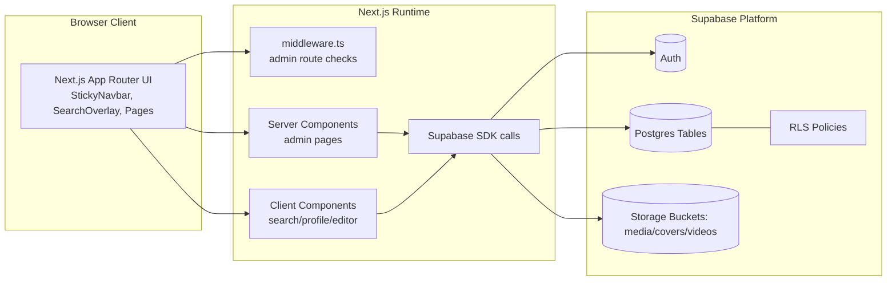
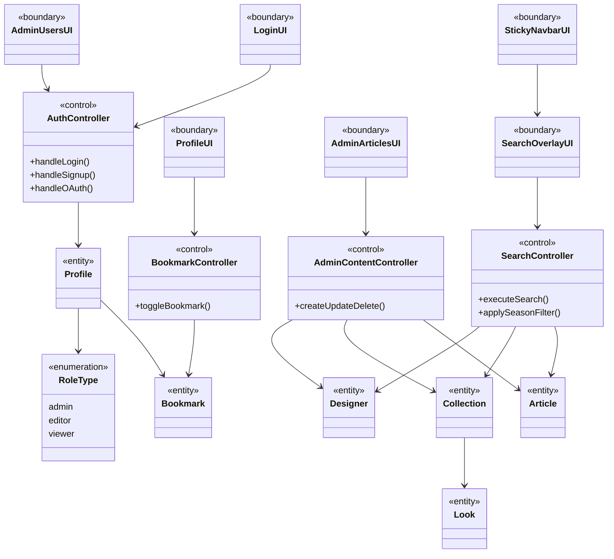
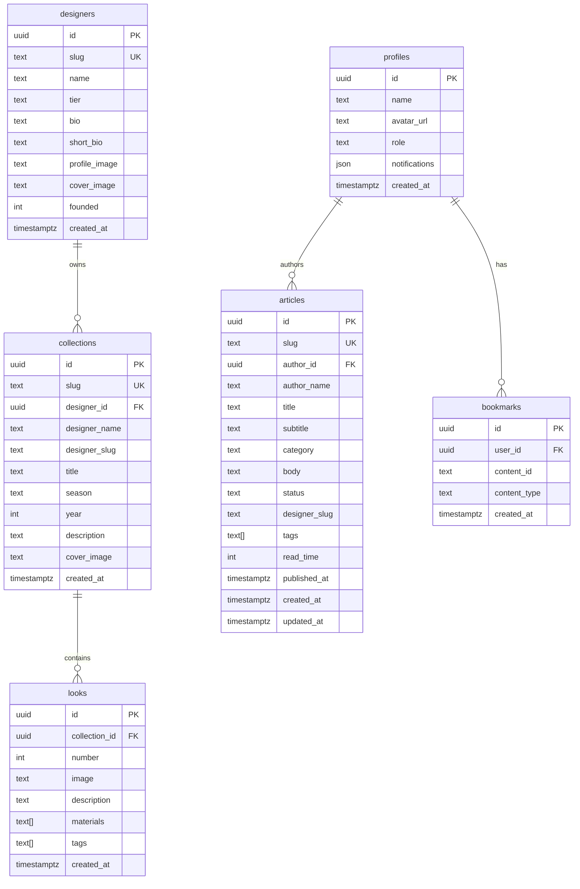
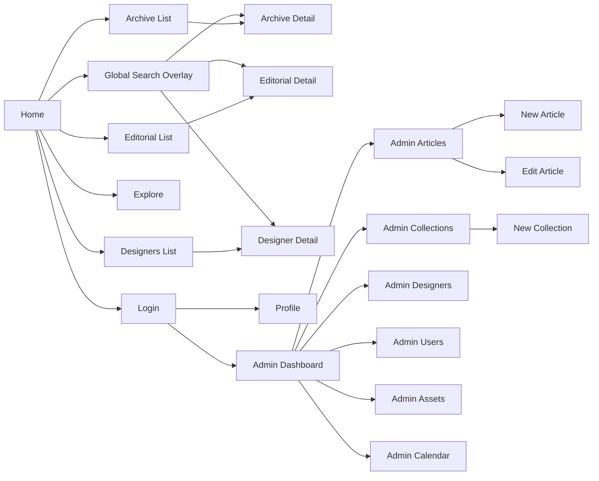

# Anoce System Diagrams (A42-Style Structure)

This pack mirrors the same diagram style progression found in `A42.pdf`:
1. Use Case Diagram
2. Analysis Class Diagram
3. Sequence Diagrams
4. Activity Diagram
5. System Architecture Diagram
6. Design Class Diagram (Boundary-Control-Entity)
7. ERD Diagram
8. UI Screen Flow Diagram

## 1) Use Case Diagram
```mermaid
usecaseDiagram
actor Visitor as V
actor User as U
actor Admin as A

rectangle "Anoce Web System" {
  (Browse Archive) as UC1
  (Browse Editorial) as UC2
  (Browse Designers) as UC3
  (Open Global Search) as UC4
  (View Item Details) as UC5

  (Sign Up / Sign In) as UC6
  (Manage Profile) as UC7
  (Save Bookmark) as UC8
  (Review Saved Content) as UC9

  (Admin Login) as UC10
  (Manage Articles) as UC11
  (Manage Collections) as UC12
  (Manage Designers) as UC13
  (Manage Users & Roles) as UC14
  (Upload/Manage Assets) as UC15
}

V --> UC1
V --> UC2
V --> UC3
V --> UC4
V --> UC5
V --> UC6

U --> UC1
U --> UC2
U --> UC3
U --> UC4
U --> UC5
U --> UC7
U --> UC8
U --> UC9

A --> UC10
A --> UC11
A --> UC12
A --> UC13
A --> UC14
A --> UC15

UC8 ..> UC6 : <<include>>
UC7 ..> UC6 : <<include>>
UC11 ..> UC10 : <<include>>
UC12 ..> UC10 : <<include>>
UC13 ..> UC10 : <<include>>
UC14 ..> UC10 : <<include>>
UC15 ..> UC10 : <<include>>
```

## 2) Analysis Class Diagram


## 3) Sequence Diagram - Global Search


## 4) Sequence Diagram - Login + Role Gate


## 5) Sequence Diagram - Admin Article Publish


## 6) Activity Diagram - End-to-End User Flow


## 7) System Architecture Diagram


## 8) Design Class Diagram (Boundary-Control-Entity)


## 9) ERD Diagram (Current Database Model)


## 10) UI Screen Flow (Prototype-Level)

